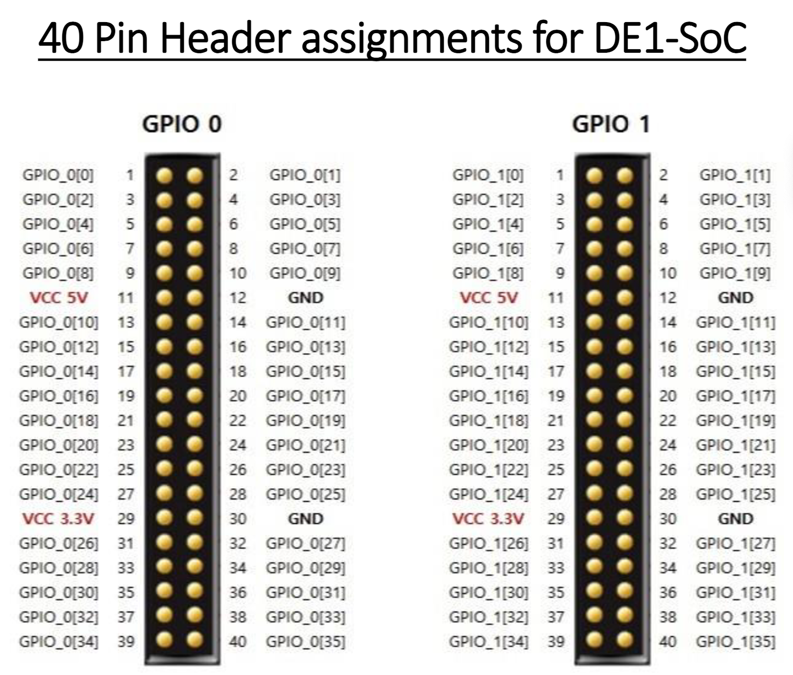

# RISC-V Soc On DE1-Soc

在 DE1-Soc FPGA 开发板上实现一个简单的 RV32I 指令集 CPU, 并且实现相关外设的控制, 比如 SDRAM, 按钮, 数码管等等.

VGA 图形能力待支持.

## 板载

### GPIO

GPIO1 区域的 40 个 pins 中, 从上到下的第 6 行左边是 VCC, 右边是 GND.
然后左上角是 `GPIO1[0]`.

GPIO0 同理.

其他 GPIO0 GPIO1 引脚可以看这张图:

来源: <http://www-ug.eecg.toronto.edu/msl/handouts/40pinDE1.pdf>

## 环境准备

本项目把环境分成三类:

- 本地仿真环境, 用于 Verilator 运行 testbench 和快速验证 RTL.
- 固件构建环境, 用于把 RISC-V 汇编程序转换成 ROM 可加载的 hex.
- 上板构建环境, 用于 Quartus 完成综合, 布线, 生成 .sof / .jic, 并下载到 DE1-SoC.

### 核心工具

#### Quartus

- 用途: 约束管脚, 综合工程, 生成 .sof / .jic, 以及板级下载.
- 要求: 需要支持 Cyclone V SoC 的 Quartus 版本, 常见做法是使用 Quartus II / Quartus Prime 的对应版本.
- 验证: `quartus_sh --version`, `quartus --version`.
- 参考文件: `riscv_soc.qpf`, `riscv_soc.qsf`, `docs/dev/quartus/buliding.md`.

#### just

- 用途: 统一管理仿真, 测试和常用开发命令.
- 安装后验证: `just --list`.
- 常用命令: `just test`, `just test-simple-rom`, `just test-rv32i-soc`.

#### Verilator

- 用途: 本地 RTL 仿真.
- 安装后验证: `verilator --version`.
- 本项目的 `just` 已经封装了常用的 `build-verilog-*` 和 `run-verilog-*` recipe.

#### RISC-V binutils

- 用途: 生成和查看上板 demo 的机器码, 例如把 `board_demo.S` 汇编成 `board_demo.hex`.
- macOS 示例: `brew install riscv64-elf-binutils`

#### Zig

- 用途: 编译裸机 C 固件, 目前 `just firmware-c-demo` 使用 `zig cc` 生成 RV32I 目标文件.
- 安装后验证: `zig version`.
- 目标参数: 当前使用 `-target riscv32-freestanding -mcpu=baseline_rv32 -mabi=ilp32`, 对应 RV32 裸机环境, 不依赖宿主系统库.
