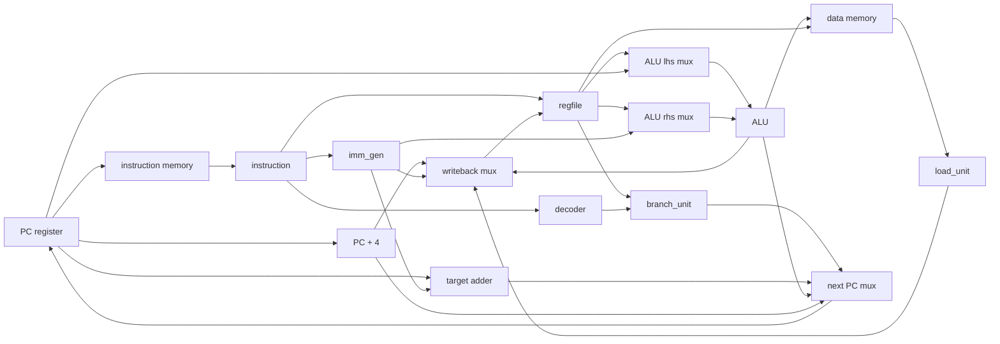

# RV32I CPU 结构和接线参考

本文档整理 RV32I CPU 第一版实现需要关注的处理器结构, 模块边界和信号接线. 资料主要来自 RISC-V 官方 ISA 手册, lowRISC Ibex 文档和 PicoRV32 文档. 本项目第一版目标是写出容易仿真, 容易观察, 容易上板调整的 RV32I 核, 不是一开始追求高性能流水线.

## 第一版定位

- ISA: RV32I base integer, 暂不实现 M, C, A, F, D 扩展.
- 数据宽度: 32 bit.
- 寄存器: x0 到 x31, 其中 x0 永远为 0.
- 指令长度: 第一版只处理 32 bit 指令, PC 默认按 4 递增.
- 存储模型: load-store, 只有 load 和 store 指令访问数据存储器.
- 微架构: 先按单周期数据通路理解, 后续接 FPGA block RAM 时可以自然拆成多周期取指和访存.

## 资料要点

- RV32I 有 32 个通用寄存器和一个 PC, XLEN=32, x0 固定为 0.
- 基础指令格式主要是 R, I, S, U, B, J. 其中 rs1, rs2, rd 在不同格式里尽量保持固定位置, 这能简化 decoder.
- 大多数 immediate 都需要符号扩展, 符号位来自 instr[31].
- RV32I 是 load-store 架构, 算术逻辑指令只操作寄存器, load/store 使用 rs1 加 12 bit 符号扩展偏移形成有效地址.
- R-type 运算读 rs1 和 rs2, 写 rd. ADD/SUB 溢出直接截断低 XLEN 位, SLT 和 SLTU 分别是有符号和无符号比较.
- 移位指令在 RV32I 中只使用移位量低 5 bit.
- JAL 写回 pc+4, 跳转目标为 pc 加 J immediate. JALR 写回 pc+4, 跳转目标为 rs1 加 I immediate, 并清除 bit 0.
- 分支指令直接比较两个寄存器, 不需要额外 condition code 寄存器.

## 第一版 CPU 总图



## 数据通路接线

| 来源 | 目标 | 信号 | 宽度 | 作用 |
| --- | --- | --- | --- | --- |
| PC | instruction memory | imem_addr | 32 | 当前取指地址 |
| instruction memory | decoder | instr | 32 | 当前指令 |
| instr[19:15] | regfile | rs1_addr | 5 | 第一个源寄存器地址 |
| instr[24:20] | regfile | rs2_addr | 5 | 第二个源寄存器地址 |
| instr[11:7] | regfile | rd_addr | 5 | 目标寄存器地址 |
| regfile | ALU lhs mux | rs1_data | 32 | 普通 ALU 左操作数 |
| regfile | ALU rhs mux | rs2_data | 32 | R-type 右操作数和 store 写数据 |
| imm_gen | ALU rhs mux | imm | 32 | I/S/U/B/J immediate |
| PC | ALU lhs mux | pc | 32 | AUIPC 或目标地址计算可用 |
| ALU | data memory | dmem_addr | 32 | load/store 有效地址 |
| regfile | data memory | dmem_wdata | 32 | store 写入数据 |
| data memory | load_unit | dmem_rdata | 32 | load 原始读数 |
| load_unit | writeback mux | load_data | 32 | 完成符号扩展或零扩展后的 load 结果 |
| ALU | writeback mux | alu_result | 32 | 算术逻辑结果 |
| PC + 4 | writeback mux | pc_plus4 | 32 | JAL/JALR 返回地址 |
| imm_gen | writeback mux | imm_u | 32 | LUI 写回值 |
| writeback mux | regfile | rd_data | 32 | 写回寄存器的数据 |
| next PC mux | PC | next_pc | 32 | 下一条指令地址 |

## 控制信号接线

| 来源 | 目标 | 信号 | 建议宽度 | 作用 |
| --- | --- | --- | --- | --- |
| decoder | ALU | alu_op | 4 | 选择 ADD, SUB, SLL, SLT, SLTU, XOR, SRL, SRA, OR, AND |
| decoder | ALU lhs mux | alu_lhs_sel | 1 or 2 | 选择 rs1 或 pc |
| decoder | ALU rhs mux | alu_rhs_sel | 1 or 2 | 选择 rs2 或 immediate |
| decoder | regfile | rd_we | 1 | 是否写回 rd |
| decoder | writeback mux | wb_sel | 2 or 3 | 选择 ALU, load, pc+4, immediate |
| decoder | data memory | dmem_req | 1 | 是否访问数据存储器 |
| decoder | data memory | dmem_we | 1 | 1 表示 store, 0 表示 load |
| decoder/load_store_unit | data memory | dmem_be | 4 | 字节使能, 支持 SB, SH, SW |
| decoder | load_unit | load_op | 3 | 选择 LB, LBU, LH, LHU, LW |
| decoder | branch_unit | branch_op | 3 | 选择 BEQ, BNE, BLT, BGE, BLTU, BGEU |
| decoder | next PC mux | jump | 1 | JAL 或 JALR |
| decoder | core control | illegal_instr | 1 | 非法指令标记 |

## 分阶段模块边界

### regfile

- 输入 rs1_addr, rs2_addr, rd_addr, rd_data, rd_we.
- 输出 rs1_data, rs2_data.
- x0 组合读永远输出 0.
- rd_we 有效且 rd_addr 非 0 时在时钟上升沿写入.

### alu

- 输入 alu_op, lhs, rhs.
- 输出 result.
- 纯组合逻辑, 不需要 clk.
- 覆盖 RV32I 整数运算和分支比较需要的基础运算.

### imm_gen

- 输入 instr.
- 输出 imm_i, imm_s, imm_b, imm_u, imm_j, 或者输出一个由 decoder 选择后的 imm.
- 所有需要符号扩展的 immediate 都从 instr[31] 扩展.
- B/J immediate 已经在生成阶段补好低位 0, 方便直接和 pc 相加.

### decoder

- 输入 instr.
- 解析 opcode, funct3, funct7, rd, rs1, rs2.
- 输出 ALU, regfile, data memory, branch, writeback 需要的控制信号.
- 第一版可以把 SYSTEM, FENCE, 未支持扩展都标成 illegal_instr 或 NOP 策略, 后面再补 trap.

### branch_unit

- 输入 branch_op, rs1_data, rs2_data.
- 输出 branch_taken.
- BEQ/BNE 用等值比较.
- BLT/BGE 用有符号比较.
- BLTU/BGEU 用无符号比较.

### load_store_unit

- store 根据 funct3 和地址低位生成 dmem_be 和对齐后的 dmem_wdata.
- load 根据 funct3 和地址低位选择 byte/half/word, 再做符号扩展或零扩展.
- 第一版建议先只支持自然对齐访问, 未对齐访问先进入 illegal 或 trap 路径.

## 顶层接口建议

第一版 CPU core 可以暴露一组很薄的指令存储器和数据存储器接口. 这样先接仿真 ROM/RAM, 后续再接 SoC 总线或 MMIO.

```verilog
module rv32i_core (
    input wire clk,
    input wire rst_n,

    output wire [31:0] imem_addr,
    input wire [31:0] imem_rdata,

    output wire dmem_req,
    output wire dmem_we,
    output wire [3:0] dmem_be,
    output wire [31:0] dmem_addr,
    output wire [31:0] dmem_wdata,
    input wire [31:0] dmem_rdata
);
```

后面如果要支持同步 memory 或 valid-ready 总线, 可以在这个接口上增加 imem_valid, imem_ready, dmem_valid, dmem_ready, 或者把 core 改成多周期状态机.

## 第一版实现顺序

1. regfile, 已开始.
2. alu, 先覆盖 R-type 和 I-type 算术逻辑.
3. imm_gen, 单独测试 I/S/B/U/J immediate.
4. decoder, 先输出字段和主要控制信号.
5. branch_unit, 单独测试 6 种 branch.
6. load_store_unit, 先测试 byte enable 和 load 扩展.
7. rv32i_core, 先跑不访问 memory 的算术程序.
8. 加 ROM/RAM, 再跑 load/store 和 branch 程序.

## 参考来源

- [RISC-V Unprivileged ISA, RV32I Base Integer Instruction Set](https://docs.riscv.org/reference/isa/v20240411/unpriv/rv32.html)
- [lowRISC Ibex, Pipeline Details](https://ibex-core.readthedocs.io/en/latest/03_reference/pipeline_details.html)
- [lowRISC Ibex, Instruction Decode and Execute](https://ibex-core.readthedocs.io/en/latest/03_reference/instruction_decode_execute.html)
- [lowRISC Ibex, Load-Store Unit](https://ibex-core.readthedocs.io/en/latest/03_reference/load_store_unit.html)
- [YosysHQ PicoRV32 README](https://github.com/YosysHQ/picorv32)
